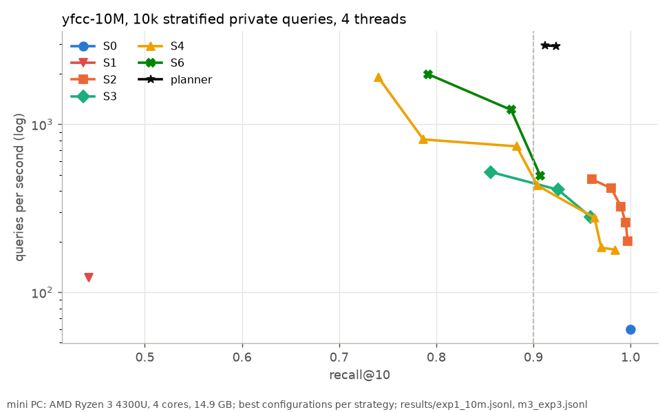
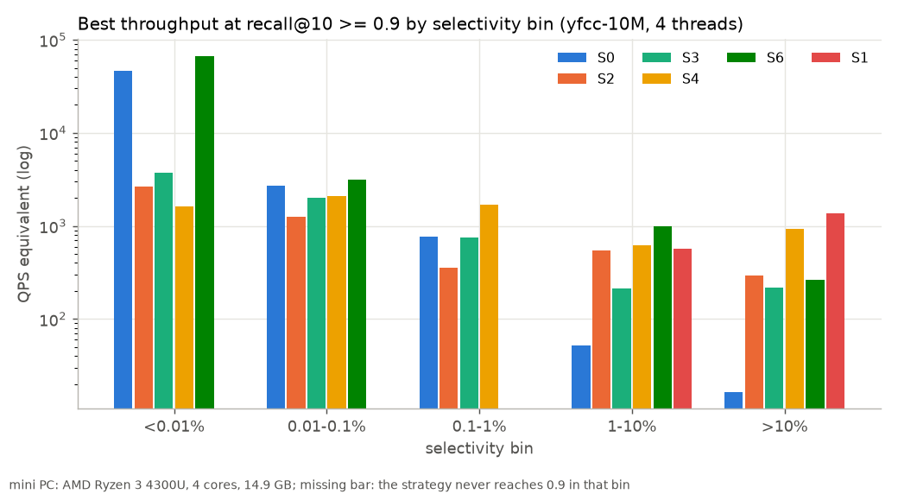
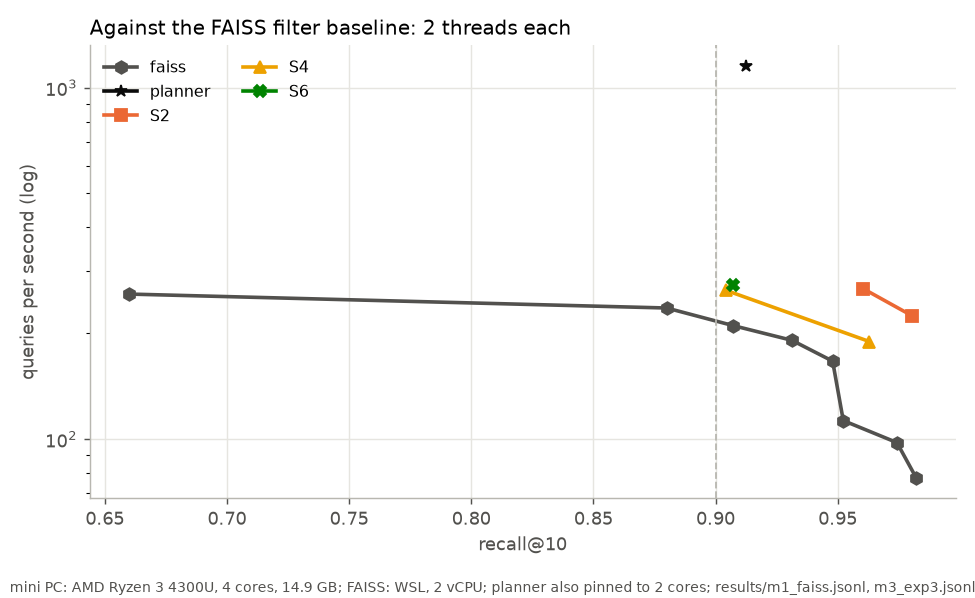
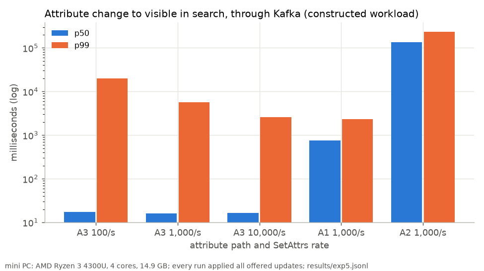

# Which filtered vector search strategy wins, at what selectivity, on Lucene?

Every marketplace, store and ad system runs vector search where the query also carries attribute
filters: in stock, this category, ships here, this advertiser's targeting. The NeurIPS'23 Big-ANN
competition made this a track of its own, because neither the graph indexes nor the inverted-file
indexes handle it well across the board, and every vector database since has shipped a different
answer. FacetIndex puts five answers side by side inside one Lucene-based engine, on the track's own
data, and adds a planner that picks per query.

All numbers here come from `results/*.jsonl` (see `NUMBERS.md`). They were measured on a 4-core
AMD Ryzen 3 4300U mini PC with 14.9 GB of RAM, not on the competition's 8-vCPU scoring VM, so no
absolute number here is comparable to the leaderboard; the comparison that is fair is against the
track's FAISS baseline, rerun on the same box with the same queries.

## The data

`yfcc-10M`: 10 million images as 192-dimensional uint8 CLIP vectors, each with a bag of tags from a
200,386-word vocabulary (about 10.8 tags per image). A query is an image vector plus one or two tags,
and a result must carry every query tag. The query set is built so that selectivity spans five
decades: roughly a quarter of the queries match under 0.01% of the items (fewer than 1,000), a
quarter 0.01 to 0.1%, a quarter 0.1 to 1%, a quarter 1 to 10%, and 6% match more than 10%
(`results/m0_data.jsonl`).

## The strategies

- **S0, brute force over the matches.** Intersect the tag bitmaps, score every match with a SIMD
  kernel. Exact; its cost is the number of matches.
- **S1, post-filter.** Ask the graph for k/selectivity candidates and drop the non-matching ones.
- **S2, Lucene's filtered HNSW.** Traverse the graph, keep only matching nodes as results, fall back
  to an exact scan when the filter is tiny or the visit limit runs out.
- **S3, Lucene's ACORN-1 style search.** Traverse only matching nodes, expanding to neighbours of
  neighbours to stay connected.
- **S4, IVF with posting-list intersection.** k-means cells as RoaringBitmaps; probe the nearest
  cells and intersect each with the tag bitmaps.
- **S6, per-tag IVF.** Every tag with at least 10,000 items gets its own small IVF trained on its
  own items (ParlayANN's idea), so a probed cell is all matches.

## Results

The static results use 10,000 private queries, 2,000 from each selectivity bin, so every regime is
represented equally (the rarest bin is over-weighted relative to the full query set; `NUMBERS.md`
also gives population-weighted figures). All files below are in `results/`.

### No single strategy wins everywhere

At recall@10 >= 0.9 and 4 threads, the best single configurations are close to each other: per-tag
IVF (S6, 0.907 at 493 QPS), Lucene's default filtered HNSW (S2 at beam 16, 0.960 at 470 QPS), and
the global IVF with bitmap intersection (S4, 0.904 at 432 QPS with 16,384 cells), with Lucene's
ACORN-1 path (S3) at 0.925 and 408 QPS (`exp1_10m.jsonl`). Brute force over the matches (S0) is
exact but averages 60 QPS on this sample, because a fifth of the queries match more than a million
items. Post-filtering (S1) never reaches 0.9 overall.

The per-bin view shows why a planner pays (`exp1_10m.jsonl`, bins):

- Under 0.01% (fewer than 1,000 matches), brute force over the matches runs at about 15,000 QPS
  equivalent and is exact (S6 shows 16,368 because it falls back to the same scan there); every
  graph strategy and the global IVF are an order of magnitude slower.
- Between 0.01% and 0.1%, S0 still beats the graph (2,670 against S2's 1,213), and S6's
  candidate-count search (which falls back to S0 under 20,000 matches) does best at 3,058.
- From 0.1% up, scanning matches gets expensive (S0 drops to 419 and then 52 QPS) and the IVF
  strategies take over: S4 at 1,256 QPS for 0.1 to 1%, S6 at 986 for 1 to 10%.
- Above 10% selectivity, post-filtering, the naive baseline, is the best strategy (1,377 QPS
  equivalent): when a tenth of everything matches, the unfiltered graph's neighbours already pass.
- Lucene's default filtered HNSW is never the fastest in any bin but clears 0.9 in all of them,
  which is why it is the best single configuration by recall.

### The planner

The planner fits each configuration's latency and recall as a function of the query's exact match
count (one-tag and two-tag separately) on the public sample, then per query minimises predicted
latency minus λ times predicted recall, with λ chosen on the public sample to land at 0.9 plus a
margin. Scored live on the private sample at 4 threads it reaches recall 0.912 at 2,945 QPS
(`m3_exp3.jsonl`): 6.0x the best single configuration, and 2.9x the FAISS baseline's own two-way
rule rebuilt inside FacetIndex (brute force below `mt_threshold`, IVF above: best 1,018 QPS at
0.952). Its choices mirror the per-bin picture: brute force through S6's fallback for selective
queries, S4 and S6 for the middle, and post-filtering for the broadest filters. Choosing costs a
mean of 77 microseconds per query.

Against an oracle that knows, for each private query, the cheapest configuration reaching 8 of 10
true neighbours (0.953 recall at 2,973 QPS derived from measured latencies), the planner gets
similar throughput at lower recall; against the oracle requiring 9 of 10 (0.977 at 2,478) it is
faster at lower recall. 63% of its choices differ from the 9-of-10 oracle's, and 20% of queries
land below 0.9 on that query, which is the price of trading by bin averages; only 4.7% cost more
than twice the oracle's latency.

### Against the track's FAISS baseline, on the same box

The benchmark's own FAISS baseline (`IVF16384,SQ8` with binary signatures and the `mt_threshold`
rule, its search code unchanged) ran in WSL, which this box caps at 2 vCPUs. Its best throughput at
recall >= 0.9 on the same 10,000 queries was 210 QPS (`m1_faiss.jsonl`). The planner pinned to 2
cores reached 0.912 at 1,151 QPS (`m3_exp3.jsonl`), **5.5x the FAISS baseline on the same machine
and queries**. For context only, and on different hardware (the competition's 8-vCPU Azure D8lds
v5), the winning entry was about 11.6x FAISS and the closed-source leaders about 28x; FacetIndex's
ratio is not directly comparable to those, since the hardware, the FAISS training sample and the
query sample all differ.

## Updates while serving

A live catalog changes all the time, and the question is whether an attribute change has to touch
the vector. FacetIndex streams inserts, deletes and attribute changes through Kafka into one
idempotent consumer and implements three ways for the filter to see a tag change:

- **A1, tags as Lucene terms:** `updateDocument`, which re-indexes the whole document and re-inserts
  its vector into the HNSW graph.
- **A2, tags as doc values:** `updateBinaryDocValue`, which leaves the vector alone.
- **A3, an external store:** per-tag RoaringBitmaps and per-row tag arrays outside Lucene, updated in
  place under a per-row seqlock, which Lucene sees through a never-cached filter.

On a constructed workload (start from 9M items, stream the rest in at 100 inserts/s, delete 100/s,
and flip tags at the stated rate; not a competition track), measured over 150 s windows
(`results/exp5.jsonl`):

- A3 kept up at 10,000 SetAttrs/s through Kafka (9,999.7/s applied, no backlog), and an attribute
  change reached the next query in 16.7 ms at the median. The tail is long (p99 2.6 s at 10,000/s,
  20 s at 100/s); it does not grow with the rate, which points at the single consumer thread
  stalling behind the Lucene writes for inserts and deletes it also applies.
- A1 also kept up at 1,000/s, but a change became visible only at the next NRT refresh (0.76 s at the
  median with a 1 s refresh, against A3's 16 ms), and it merged for 23.8 s of every minute against
  2 to 7 s for A3: every tag change rebuilt a document and re-inserted its vector.
- A2 broke down at 1,000/s: Lucene's write-to-visible p99 reached 235 s and the index grew from 2.97
  to 3.37 GB in 150 s, because every refresh writes a new generation of the doc-value field for the
  whole 9M-document segment, and the doc-value filter has to scan every document.
- Filtered recall at the checkpoints did not drift during the updates (S2 0.991 to 0.993).
- Running the same 10,000/s A3 workload in process, without Kafka, cut the S2 query p99 from 1.33 s
  to 0.25 s: on a 4-core box the broker and the consumer compete with the queries for CPU.

Mixed-load runs with the planner in the query pool (10 and 20 queries/s on top of 1,000 updates/s)
saturated the box: medians of 46 and 36 s from intended send time, even though S2 and S4 alone had
served 10 queries/s at an 18.7 ms median. The planner, calibrated on a static index, sends about a
quarter of the queries to post-filtering with fetches of up to 10,000 candidates, and the shared pool
queues behind them. A planner for a live index needs its costs measured under update load, and a
budget on per-query work.

## What I would do next

Split the consumer so attribute changes never wait behind Lucene writes; measure range predicates
(implemented, not measured); run the official streaming runbook; rerun the headline on the
competition's VM type (`scripts/azure_d8lds_v5.md`).
